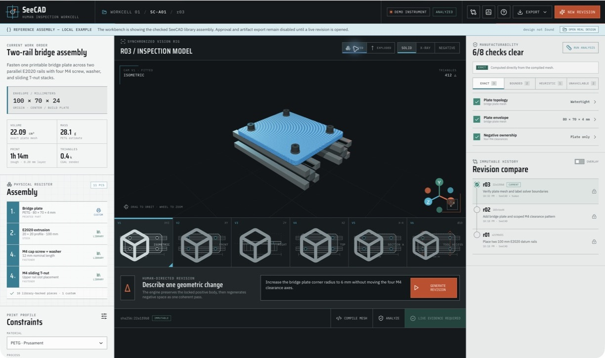
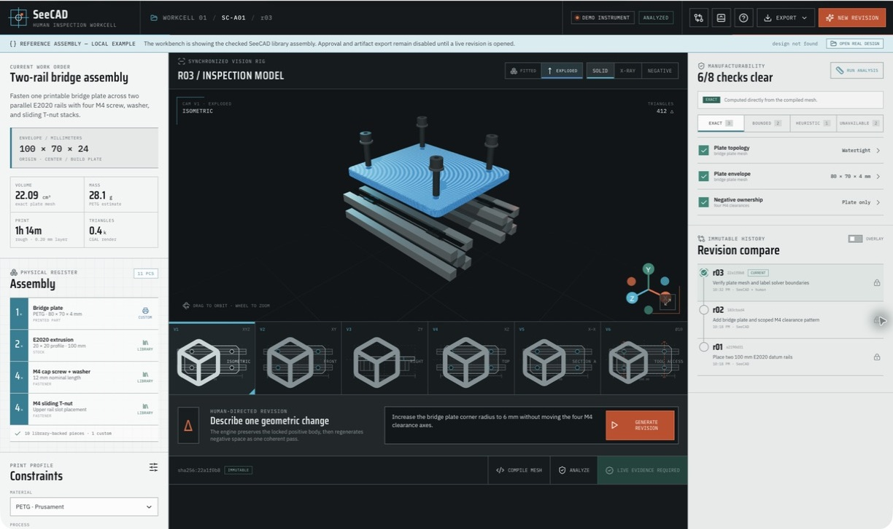
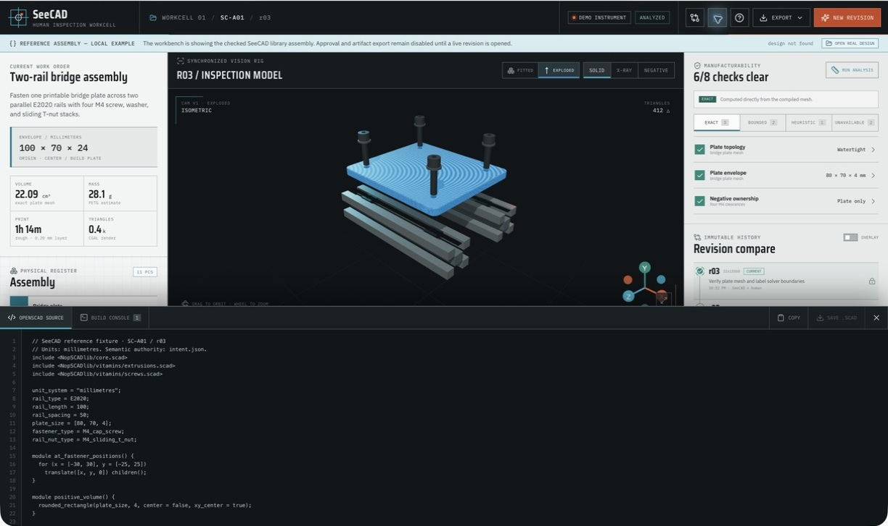
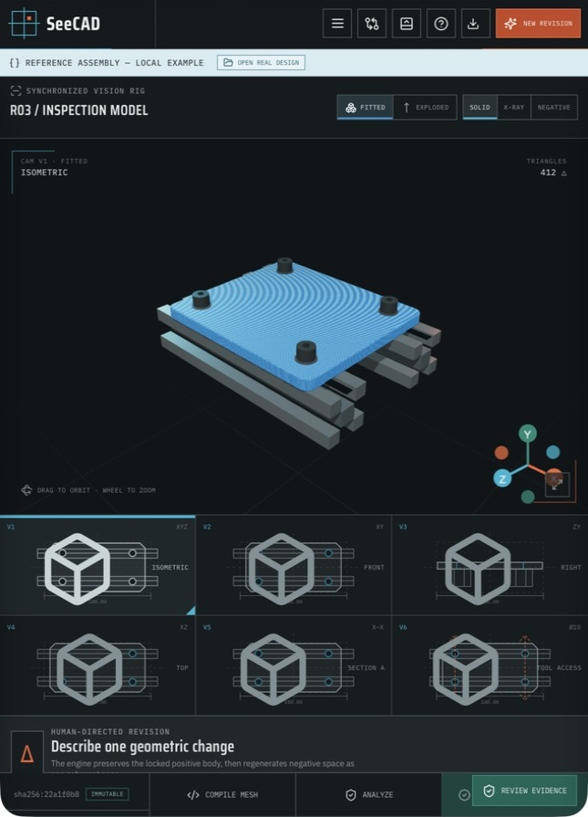

# SeeCAD

**A 3D reasoning layer for multimodal agents.**

SeeCAD turns design intent into typed constructive geometry, compiles it in a locked-down OpenSCAD worker, and returns the source, mesh, views, measurements, manufacturability findings, and provenance an agent needs to make the next change without losing the design.

It is not a text-to-STL endpoint. Semantic design intent remains authoritative and every derived artifact is reproducible.

## The workbench, at a glance



The checked reference assembly puts the whole reasoning loop on one surface: explicit millimetre dimensions and physical instances on the left, the interactive model and six inspection views in the centre, and confidence-labelled findings plus immutable history on the right. A human can describe one geometric change without giving up the source, artifact, or evidence chain.

## The core idea

Language models handle OpenSCAD well until the boolean history starts alternating between additions and subtractions. SeeCAD makes the stable workflow structural:

```text
design intent
    ├── components            separate stock, parts, connectors, and fasteners
    ├── positive volume       union each component's material envelope
    ├── negative space        scope each removal to named target components
    └── tool access channels  scope named approach passageways the same way
```

The compiler always emits one positive phase followed by one consolidated negative phase. Each
negative is first intersected with its target component volume, so a T-slot belonging to an
extrusion cannot carve a bracket or screw head. The schema rejects conservative component-envelope
overlap and missing bounded face contacts for connectors and fasteners before SCAD generation. A
request such as “move the USB opening 2 mm left” targets a named feature, not an ambiguous line in
a growing CSG program.

The complete [NopSCADlib](https://github.com/nophead/NopSCADlib) tree is vendored and pinned, giving agents reusable parts, vitamins, fasteners, utilities, and established modeling vocabulary. Safe typed library calls are supported without allowing arbitrary includes or directives.

### Inspect the assembly as a system



Exploded inspection keeps the printable body, stock, fasteners, and interfaces legible as separate semantic components. The synchronized views expose the same assembly from six datums while the workbench keeps exact mesh facts distinct from bounded and heuristic review signals.

### Trace the visual result back to source



The source drawer connects the rendered result to explicit millimetres, pinned library calls, the positive-volume phase, and the consolidated negative-space pass. Source, mesh, measurements, findings, and revision history remain inspectable together instead of becoming disconnected downloads.

### Review at compact widths

<p align="center">
  
</p>

The central inspection flow remains available on a narrow screen; project details and evidence move into dedicated rails rather than squeezing the model into an unreadable dashboard.

## What is here

- Typed Pydantic design model with explicit units, physical components, bounded assembly contacts, material, process, constraints, positive features, component-targeted negative features, and tool-access channels.
- Standalone assembly linter that inventories individual part instances, identifies fasteners and linked tool cones, and performs bounded conservative tool-access checks without compiling CAD.
- Browser-local read-only OBJ/MTL assembly preview that preserves source visual groups without uploading CAD, inferring units, or creating a design revision.
- Deterministic SCAD generator with a restricted NopSCADlib call surface.
- Immutable SQLite revision history and SHA-256 content-addressed artifact store.
- Hardened OpenSCAD engines with time, memory, CPU, PID, network, path, and output bounds. Host development defaults to an ephemeral Docker invocation; Compose uses a dedicated no-network worker over a Unix-domain socket.
- STL/3MF compilation and a live six-camera inspection rig backed by the compiled STL.
- Deliberately invoked proof sheets with thousands of deterministic orthographic projections, a self-contained visual review surface, and a mesh-bound manifest.
- Mesh and DFM evidence: triangle and vertex counts, bounded degenerate-triangle detection, bounds, area, volume, components, watertightness, winding consistency, configured build-volume fit, and face-normal overhang burden. Checks that are not actually solved, such as minimum wall thickness, are returned as unavailable.
- Standalone single-mesh linting for STL, OBJ, PLY, OFF, GLB, and 3MF, with an explicit millimetre declaration, content digest, print-profile evidence, and ranked non-mutating axis-aligned orientation candidates.
- Canonical print-profile evidence and immutable human approval attestations that preserve the exact spec, mesh, compile report, and analysis digest chain.
- Explicit `exact`, `bounded`, and `heuristic` confidence labels on findings.
- OpenAI Responses planner using current `gpt-5.6`, structured outputs, original-detail image evidence, pro mode, and max reasoning by default.
- One service layer exposed through a CLI, FastAPI, and MCP.
- React/Three.js human review workbench with an interactive viewport, six-view rig, feature phases, constraints, diagnostics, source, and revision comparison.
- Complete NopSCADlib source, pinned OpenSCAD container, demo fixture, tests, CI, Compose stack, architecture, and security documentation.

## Quick start

Requirements: Docker, Python 3.12+, `uv`, Node 24+, and `pnpm`.

```bash
make bootstrap
make demo
```

`make demo` builds the pinned CAD worker, compiles the precision-enclosure fixture, runs analysis, and writes a reproducible evidence bundle under `.seecad/demo/`. The bundle contains the exact final analyzed revision's `design.json`, `model.scad`, generation `manifest.json`, `model.stl`, `compile-stl.json`, `analysis.json`, and `analysis-profile.json`. `evidence-manifest.json` records the source/compile/analysis revision chain plus every exported role, SHA-256 digest, byte size, media type, filename, and introducing revision.

Run the API and workbench in separate terminals:

```bash
make serve
make web
```

Open `http://localhost:5173`. The API is at `http://localhost:8000`; its OpenAPI explorer is at `/docs`.

Or run the production-shaped local stack:

```bash
docker compose up --build
```

In that stack, the API has no local OpenSCAD execution path. It streams SCAD to a single-slot worker through `/run/seecad/worker.sock`; the worker has no network namespace or API key. `auto` mode selects the per-job Docker engine and never falls back to a host binary. Public configuration cannot select local execution; only a private executor constructed inside the isolated worker process can run the container's OpenSCAD binary.

The worker build identity is a `sha256-...` digest derived from the Dockerfile, Python dependency lock, package metadata, worker/runtime source, and an explicit build seed. Before every compile, the API and worker independently revalidate the complete NopSCADlib tree and pinned upstream metadata. The API then validates the protocol and build identity, OpenSCAD version, NopSCADlib revision and tree digest, submitted source digest, and returned artifact digest before accepting a mesh. `/health` is a liveness and dependency-status readout; `/ready` returns `503` whenever storage or the worker is unavailable, and Compose uses that readiness endpoint.

### Assembly linting

`seecad lint` checks a semantic manifest directly, so an agent can inspect an
existing assembly without creating a design, starting the service, or compiling
untrusted CAD. The normative agent workflow is in the
[assembly linting contract](docs/ASSEMBLY-LINT.md):

```bash
uv run seecad lint examples/6dof_robot_arm/assembly.json
uv run seecad lint examples/6dof_robot_arm/assembly.json --format text
uv run seecad lint-schema > /tmp/seecad-assembly-lint.schema.json
```

JSON is the default output. The report always includes every declared physical
instance, grouped part families, fastener identities, tool-cone identities,
per-cone blockers, diagnostics, and limitations. A manifest must declare
`units: "mm"`; repeated parts and fasteners are repeated records rather than a
quantity hidden behind one item.

Exit status `0` means no finding reached the configured threshold, `1` means a
lint finding reached it, and `2` means the manifest or CLI options were invalid.
Use `--fail-on warning` for a stricter automation gate. Accessibility is labeled
bounded because it conservatively checks finite tool cones against declared
axis-aligned envelopes; it may produce false obstructions and does not guarantee
physical access.

The [6DoF robot-arm fixture](examples/6dof_robot_arm/README.md) records the
published base, small-drive, big-drive, and connector modules, including the
illustrated M2.5, M3, and M4 fasteners. It keeps source-backed designations
separate from heuristic drive-tool and approach assumptions.

Checked problem fixtures exercise failure behavior without committing source
CAD or generated reports:

| Fixture | Expected bounded result |
| --- | --- |
| [Blocked top-cover fastener](examples/blocked_top_cover_fastener/README.md) | One FDM sensor-pod screw has no clear declared approach. |
| [Blocked alternative approaches](examples/blocked_alternative_approaches/README.md) | Both straight and angled approaches to a CNC fixture bolt are obstructed. |
| [Mixed service-panel access](examples/mixed_service_panel_access/README.md) | One repeated gearbox-panel screw is clear and one is blocked. |

Minimum wall thickness is not used as a negative fixture because the current
mesh analyzer labels that property `unavailable`; these examples only claim the
tool-access findings the assembly linter can actually produce.

### Standalone mesh linting

For one imported mesh—not an assembly—run topology and print-orientation preflight without
creating a `DesignSpec` or changing the source file:

```bash
uv run seecad mesh-lint model.stl \
  --units mm \
  --profile examples/mesh_lint/fdm-profile.json
uv run seecad mesh-lint model.stl \
  --units mm \
  --profile examples/mesh_lint/fdm-profile.json \
  --format text --fail-on warning
```

The report evaluates all 24 rigid axis-aligned orientations and returns the best six by default.
Exact parsed-mesh facts remain separate from bounded build-volume fit and heuristic face-normal
overhang ranking. It does not run a slicer, repair the model, guess units, prove minimum wall
thickness, or substitute for the mandatory assembly manifest workflow. See the
[standalone mesh-lint contract](docs/MESH-LINT.md).

### Proof sheets

Proof sheets are a deliberately invoked review mode for a compiled SeeCAD revision. The default
operation pre-computes 2,048 orthographic projections: six datum views, the corners and edge
diagonals, then a deterministic spherical distribution. It creates an immutable child revision
with a self-contained HTML gallery, a ZIP containing every projection PNG, and a JSON manifest that
binds the catalog to the STL digest.

```bash
uv run seecad proof-sheets DESIGN_ID REVISION_ID
uv run seecad export DESIGN_ID PROOF_REVISION_ID \
  --format proof_sheets --output proof-sheets.html
```

The same explicit operation is available through `POST
/v1/designs/{design_id}/revisions/{revision_id}/proof-sheets`, the MCP server, and the workbench's
`Generate proof sheets` action. Create, revise, compile, and analyze never generate them
automatically.

The viewpoint catalog and projection hashes are exact derivatives of the recorded mesh and
algorithm; visual interpretation is heuristic. A clear-looking sheet does not prove collision
clearance, fit, tool access, manufacturability, or structural integrity. Existing and multi-part
assembly inspection still routes to the standalone assembly-lint workflow. See the
[proof-sheet contract](docs/PROOF-SHEETS.md).

### Model-backed design

Set `OPENAI_API_KEY` in the process environment or an ignored `.envrc`. The browser never receives it. Creating a design with `spec` is deterministic and makes no model call; creating one with `prompt` invokes the structured planner.

```bash
curl --fail-with-body http://localhost:8000/v1/designs \
  -H 'content-type: application/json' \
  -d '{"prompt":"A 90 x 55 x 24 mm sensor enclosure with four M3 corner fasteners, a USB-C opening, and screwdriver access from above.","requested_profile":{"process":"fdm","material":"PETG","nozzle_diameter":0.4,"layer_height":0.2,"minimum_wall":1.6,"minimum_clearance":0.35,"maximum_unsupported_overhang_degrees":45,"build_volume":{"x":220,"y":220,"z":250}},"load_case":"Wall mounted; carry a 2 kg static vertical load."}'
```

Compilation and analysis are explicit revision operations:

```bash
curl --fail-with-body -X POST \
  http://localhost:8000/v1/designs/DESIGN_ID/revisions/REVISION_ID/compile \
  -H 'content-type: application/json' -d '{"format":"stl"}'

curl --fail-with-body -X POST \
  http://localhost:8000/v1/designs/DESIGN_ID/revisions/REVISION_ID/analyze \
  -H 'content-type: application/json' -d '{"auto_compile":true}'

curl --fail-with-body -X POST \
  http://localhost:8000/v1/designs/DESIGN_ID/revisions/ANALYZED_REVISION_ID/approve \
  -H 'content-type: application/json' \
  -d '{"attestor":"Human reviewer","statement":"Reviewed the exact compiled mesh and analysis evidence."}'
```

### MCP

Start the stdio server directly:

```bash
make mcp
```

Example client configuration:

```json
{
  "mcpServers": {
    "seecad": {
      "command": "uv",
      "args": ["run", "seecad", "mcp"],
      "cwd": "/absolute/path/to/seecad"
    }
  }
}
```

The MCP tools create designs, add revisions, compile, analyze, compare, inspect artifacts, and export evidence. They return compact typed records rather than embedding large binary artifacts in model context.

## Evidence, not false certainty

SeeCAD separates what it knows from what it estimates:

| Trust level | Examples | Meaning |
| --- | --- | --- |
| Exact | mesh bounds, volume, area, components, watertightness | Directly computed from a specific artifact |
| Bounded | current-orientation printer-volume fit | Valid under the recorded printer profile |
| Heuristic | downward-facing area and support review | A review signal, not proof |
| Unavailable | minimum wall thickness and structural integrity | Explicitly not solved by the current analyzer |

SeeCAD does not claim structural integrity. It preserves load-case and solver boundaries for a future simulation adapter rather than dressing mesh heuristics up as engineering certification.

## Repository map

```text
src/seecad/             domain, compiler, engines, storage, analysis, API, CLI, MCP
web/                    React/Three.js evidence workbench
examples/               reproducible reference designs
scripts/compose_smoke.py production API/UDS/STL/3MF/provenance smoke test
vendor/NopSCADlib/      complete pinned upstream library
docker/                 isolated OpenSCAD worker
docs/ARCHITECTURE.md    data flow and trust boundaries
docs/ASSEMBLY-LINT.md   mandatory existing-assembly agent workflow and trust contract
docs/MESH-LINT.md       standalone single-mesh topology and orientation workflow
docs/PROOF-SHEETS.md    explicit high-coverage visual projection review workflow
docs/SECURITY.md        untrusted-code sandbox contract
docs/GCODE.md           planned slicer and motion evidence adapter
```

## Development

```bash
make check          # lint, types, unit tests, frontend test and production build
make integration    # build the CAD worker and exercise real OpenSCAD
make format
```

See [CONTRIBUTING.md](CONTRIBUTING.md) and [AGENTS.md](AGENTS.md) for the invariants contributors and coding agents must preserve.

## License

SeeCAD-authored code and documentation are licensed under the [MIT License](LICENSE).
Third-party components retain their own licenses. In particular, the vendored NopSCADlib
tree remains GPL-3.0-or-later; see [THIRD_PARTY_NOTICES.md](THIRD_PARTY_NOTICES.md), its
upstream [`COPYING`](vendor/NopSCADlib/COPYING), and the exact pinned provenance in
[`vendor/NopSCADlib.UPSTREAM.json`](vendor/NopSCADlib.UPSTREAM.json).
