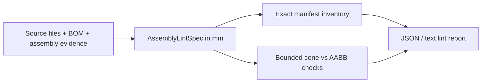
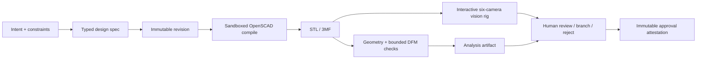
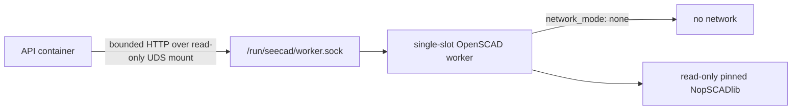

# Architecture

SeeCAD is a local-first CAD reasoning system for agents and human reviewers. The source of truth is a typed semantic design, not a triangle mesh and not an unconstrained chat transcript.

## Constructive design contract

Schema 1.1 models a design as explicit physical components. Every positive solid belongs to
one component, and every negative feature and tool-access channel names the components it may
cut. The semantic model has three ordered layers:

1. **Positive volume** — named primitives and reusable NopSCADlib parts are grouped by physical component and then united into the intended material envelope.
2. **Negative space** — named bores, pockets, clearances, slots, and channels are intersected with their target component envelopes, united, and subtracted once from the positive envelope.
3. **Tool access** — access passageways are a specialized, component-targeted negative feature with an approach vector, tool diameter, working depth, and clearance. They remain explicit so an agent can modify access without rediscovering the boolean tree.

The SCAD compiler emits this shape:

```scad
difference() {
  union() { component_positive_volumes(); }
  union() {
    intersection() { negative_feature(); target_component_positive_volume(); }
    intersection() { tool_access_channel(); target_component_positive_volume(); }
  }
}
```

This retains one design-level `difference()` without allowing an extrusion slot, bore, or
service passage to carve brackets, fasteners, or other non-target components. Distinct
component solids must also pass a conservative transformed-AABB non-interference check.
Connectors declare at least two required contacts and fasteners at least one; required contacts
must present bounded AABB face contact. These assembly checks are deliberately labeled bounded:
they reject envelope overlap and obvious floating hardware but do not prove load transfer,
preload, fit, or structural integrity. See [Assembly geometry safety](ASSEMBLY-SAFETY.md).

This avoids alternating boolean histories that are hard for language models to preserve. A generated `.scad` file is an inspectable derivative of the semantic model. Arbitrary hand-written SCAD is deliberately outside the trusted input contract. Historical schema 1.0 revisions remain readable as immutable evidence, but cannot receive new compile, analysis, or approval artifacts.

## Existing-assembly lint contract

Existing or externally sourced assemblies use a separate semantic authority:
`AssemblyLintSpec`. It does not enter the constructive design/revision pipeline and does not
compile source CAD. Each manifest declares millimetres, one record per physical instance, a
conservative assembled-coordinate AABB for every instance, fastener identity/evidence, and linked
finite tool cones.



Assembly-lint tool cones are inspection envelopes and never remove geometry. Constructive
`DesignSpec.tool_access_channels` are scoped negative features and do remove geometry during SCAD
generation. Agents must route inventory, fastener identification, and existing-assembly driver
access questions to `seecad lint`; mesh analysis and compilation do not answer those questions.

The linter is exact about the manifest's declared instance register and relationships. Its
accessibility result is bounded and conservative over the declared AABBs. A clear cone does not
prove source completeness, exact physical access, assembly sequence, moving-joint clearance, fit,
preload, thread engagement, manufacturability, or structural integrity. See
[Assembly linting contract](ASSEMBLY-LINT.md).

## Revision and evidence pipeline



Each artifact is addressed by its SHA-256 digest. Source revisions record the semantic spec, generated SCAD, manifest, and exact planner input, including typed print-profile and load constraints. Compile revisions add the mesh and a bounded diagnostics report with engine identity, elapsed time, and verified remote-worker provenance when applicable. Analysis revisions record the exact canonical `PrintProfile`, its SHA-256, the mesh digest, and exact, bounded, heuristic, and unavailable findings. An approval is allowed only from an analyzed revision; its immutable child preserves every parent artifact and adds an attestation that references the exact spec, STL, compile report, analysis, and profile digests. Demo evidence export reads every file from the final analyzed revision and adds a deterministic inventory that binds each role and digest to the complete source/compile/analysis revision chain. Derived files can be regenerated from the semantic design without treating the mesh as source of truth.

## Surfaces

- **Python service layer** owns all state transitions and invariants.
- **CLI** is the automation and local operator surface.
- **HTTP API** supports the review workbench and remote agents.
- **MCP server** exposes compact, typed CAD tools to model clients.
- **React workbench** gives humans the same revision, views, metrics, and findings that the agent sees.

No surface has a private implementation of compile or analysis behavior.
The pure assembly linter is intentionally CLI-first, stateless, and independent of the design
service, database, planner, and OpenSCAD worker.

## OpenSCAD execution boundaries

The host configuration defaults to the per-job Docker engine. It launches the small pinned OpenSCAD image with no network, a read-only root, explicit bind mounts, and per-process resource limits. `auto` mode considers Docker only; it never falls back to an unsandboxed host OpenSCAD binary. Public settings cannot express local execution; a private executor class inside the isolated worker is the only path that runs the container's OpenSCAD binary.

Compose uses a separate execution shape so the API container never runs generated SCAD beside application state or an OpenAI key:



The worker accepts only raw UTF-8 SCAD up to 8 MiB and an `stl` or `3mf` format selector. One compile may run at a time; concurrent requests fail busy. A successful response binds the raw mesh to the request and worker identity with protocol version, worker build ID, OpenSCAD version, NopSCADlib revision and recomputed tree digest, source SHA-256, artifact SHA-256, byte count, duration, and bounded base64 diagnostics headers. The API streams the response under its artifact limit and verifies every identity and digest before it creates a derived revision.

The worker build ID is content-derived at image build time from the Dockerfile, `pyproject.toml`, `uv.lock`, runtime Python sources, and an explicit build seed. The resulting `sha256-...` identity is stored read-only in the image and must match on both sides of the socket. NopSCADlib provenance is not cached: both API and worker recompute and verify the pinned metadata and complete tree immediately before every compile, so a live bind-mount mutation cannot retain stale provenance.

`/health` is the API liveness and dependency-status readout and remains reachable with a degraded payload. `/ready` and `/v1/ready` are worker-aware readiness gates: they return `503` unless storage is writable and the bounded UDS worker probe succeeds. Compose uses `/ready` for API health, so worker loss withdraws API readiness instead of presenting a partially functional service as healthy.

## Analysis trust levels

- `exact`: directly computed from the compiled mesh, such as triangle and vertex counts, bounds, surface area, volume, component count, winding consistency, and watertightness; or structurally guaranteed by schema/compiler construction, such as component-targeted negative ownership.
- `bounded`: computed under an explicit process or numerical assumption, currently component non-interference and required face contact from conservative transformed AABBs, the current-orientation build-volume fit, and the scale-relative degenerate-triangle threshold.
- `heuristic`: useful evidence that is not proof, currently the downward-facing area/support signal derived from face normals.
- `unavailable`: a requested engineering property that the analyzer did not solve, currently minimum wall thickness, physical assembly fit and support, and structural integrity.

Structural integrity is intentionally not claimed. A future solver adapter may add load cases and material models, but results must retain assumptions and solver provenance.

## Future engine adapters

The present engine compiles typed designs through OpenSCAD. CadQuery, FreeCAD, slicers, render capture, and G-code interpreters can later implement the same immutable artifact/provenance boundary without changing revision semantics.
