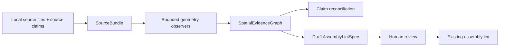

# Sprint 0001: Imported Geometry Spatial Evidence Loop

Status: Planned

## Pyramid Index

- **L0:** Give SeeCAD an agent-native, evidence-linked path from untrusted 3D source material to reviewable spatial conclusions without confusing observations with authoritative design intent.
- **L1:**
  - Add immutable local `SourceBundle` ingestion with explicit millimetres, provenance, licensing, hashes, coordinate frames, and bounded offline parsing.
  - Add a non-authoritative `SpatialEvidenceGraph` that records bodies, occurrences, interfaces, measurements, claims, contradictions, assumptions, and exact/bounded/heuristic confidence.
  - Expose assembly lint and mesh lint through MCP, then add matching CLI/MCP operations for ingest, observe, reconcile, and draft-assembly.
  - Prove the vertical slice on a synthetic organizer fixture derived from the behavioral questions raised while vetting a real Printables model.
  - Preserve fit, motion, process, design-revision, and benchmark capabilities as an explicit P2-P5 roadmap.
- **L2:**
  - The field report and command audit establish what SeeCAD could and could not prove today.
  - Architecture and contracts define the trust boundary and evidence model.
  - The implementation plan identifies concrete repository surfaces and acceptance gates.
  - The future roadmap defines the longer path to definitive agentic “thinking in 3D.”

## Overview

SeeCAD already has two strong semantic authorities:

- `DesignSpec` for generated designs whose intent is explicit and reproducible.
- `AssemblyLintSpec` for non-mutating inspection of existing or imported assemblies.

It also has immutable revisions, content-addressed derivatives, sandboxed OpenSCAD execution, standalone mesh linting, proof-sheet concepts, and explicit `exact`, `bounded`, and `heuristic` result labels.

The missing bridge is imported-geometry interpretation. During the organizer vet, SeeCAD could validate a carefully prepared assembly manifest, but it could not ingest the source pack, inventory geometry, recover spatial observations, reconcile listing claims, or explain how each conclusion followed from evidence. Those steps required ad hoc mesh scripts outside the product.

Sprint 0001 builds the smallest useful end-to-end bridge:



`SourceBundle` and `SpatialEvidenceGraph` are evidence surfaces, not design authorities. They must never silently become `DesignSpec`, compile generated CAD, or promote a draft assembly manifest without review.

## Field Report: Printables Organizer Vet

Reference: [Modular Honeycomb Desktop Organizer](https://www.printables.com/model/1770208-modular-honeycomb-desktop-organizer)

### Verdict

The original model is printable and its two supplied meshes are topologically healthy, but the listing is materially misleading. It should be skipped when actual modularity is the buying criterion. The creator acknowledged in comments that the original is not modular and linked a later V2 model.

### Observed facts

| Finding | Result | Confidence and basis |
| --- | --- | --- |
| Supplied definitions | One base STL and one drawer STL | Exact with respect to the downloaded source pack |
| Intended assembly | One shell plus seven drawer occurrences, eight physical instances total | Bounded: geometry and cavity layout, supported by source presentation |
| Compartments | Seven hexagonal passages, not the advertised six | Bounded mesh observation |
| Base bounds | `186.48414 × 140 × 193.2 mm` | Exact with respect to decoded mesh coordinates and the explicit mm interpretation |
| Drawer bounds | `68.82016 × 145 × 59.6 mm`; knob projects an additional `5 mm` | Exact with respect to decoded mesh coordinates and the explicit mm interpretation |
| Nominal clearance | `0.2 mm` normal clearance per side | Bounded geometric comparison; not a guarantee of printed fit |
| Modularity | The shell is one monolithic body, not attachable honeycomb modules | Bounded mesh/component observation |
| Retention | Passages run through the shell and no positive rear stop was observed | Bounded geometric observation; not proof that a drawer will fall out in use |
| Mesh health | Both meshes are watertight, winding-consistent, and free of detected degenerate/non-manifold conditions after vertex merge | Exact for the algorithms and files inspected |
| Fasteners | None represented | Exact with respect to the prepared manifest |
| License | Creative Commons Attribution-NonCommercial-NoDerivatives 4.0 | Exact with respect to source metadata retrieved during the vet |

### Important limits

- A clear assembly-lint result proved only that the supplied manifest was internally valid and that no declared part AABBs or tool cones produced warnings.
- It did not prove the source listing, infer the manifest, count cavities, measure mesh clearance, find stops, establish printed fit, or guarantee manufacturability or structural integrity.
- The assembly had no fasteners, so tool-access linting did not exercise driver cones.
- The third-party CAD and generated lint artifacts stayed outside the repository and must remain uncommitted.

## SeeCAD Command Audit

These commands contributed directly to the vet:

```bash
uv run seecad lint-schema
uv run seecad lint /tmp/seecad-vet-1770208/assembly.json
uv run seecad lint /tmp/seecad-vet-1770208/assembly.json --format text
uv run seecad lint /tmp/seecad-vet-1770208/assembly.json --fail-on warning
```

They established:

- schema version `1.0` and explicit `units: "mm"`;
- one manifest record per physical instance;
- valid shared-coordinate AABBs and relationships;
- zero declared fasteners and tool cones;
- zero manifest warnings or errors; and
- automation behavior when warnings are treated as failures.

They did **not** establish the dimensions, compartment count, mesh topology, clearance, monolithic construction, or missing stop. Those conclusions came from supplemental STL inspection. `seecad analyze` was not used. Closing that gap is the core motivation for this sprint.

## Goals

1. Make imported geometry a first-class, immutable evidence input without making it authoritative design intent.
2. Give agents composable spatial observations with traceable evidence and calibrated confidence.
3. Put existing assembly-lint and mesh-lint capabilities behind MCP as well as CLI.
4. Reproduce the organizer-style reasoning chain with a legal, deterministic synthetic fixture.
5. Establish contracts that P2-P5 capabilities can extend without schema or trust-boundary churn.

## Non-Goals

- Downloading remote models inside analyzers or accepting arbitrary URLs in the core ingestion path.
- Committing the Printables model, a modified copy, screenshots, source archives, or generated analysis artifacts.
- Automatically converting imported geometry into `DesignSpec`.
- Automatically approving or promoting a drafted `AssemblyLintSpec`.
- General CAD feature recognition, arbitrary semantic segmentation, or exact B-rep reconstruction.
- Guaranteed fit, motion, accessibility, printability, strength, or manufacturability.
- Full P2 motion planning, P3 slicer/G-code analysis, P4 design mutation, or P5 corpus-scale evaluation.
- UI changes. Sprint 0001 is schema, service, CLI, MCP, security, evidence, and test work.

## Use Cases

### 1. Ingest a local source pack

An agent provides local STL/OBJ/3MF files plus explicit `units: mm`, source origin, license, retrieval time, and optional source claims. SeeCAD validates limits, hashes every byte, stores immutable content-addressed blobs, and emits a `SourceBundle` manifest.

If units are absent or ambiguous, ingestion fails. SeeCAD never guesses scale from format, dimensions, filenames, or listing copy.

### 2. Observe geometry

An agent asks SeeCAD to inventory the bundle. The bounded observer produces bodies, connected components, AABBs, mesh-health results, candidate passages, and other supported observations. Every result names its algorithm, version, inputs, frame, units, tolerance, confidence class, and evidence region.

### 3. Reconcile source claims

An agent supplies claims such as “six compartments,” “modular,” or “0.2 mm clearance.” SeeCAD compares supported claim types with observations and returns `supported`, `contradicted`, or `unresolved`. Unsupported semantic claims remain unresolved rather than being forced into a boolean result.

### 4. Draft an assembly manifest

SeeCAD turns reviewed part and occurrence hypotheses into a draft schema-`1.0` `AssemblyLintSpec`. Reused geometry may share a part definition in the evidence graph, but the draft expands every physical occurrence to its own manifest part ID and AABB.

### 5. Continue with existing checks

The agent runs assembly lint or mesh lint through either CLI or MCP and receives the same schemas, confidence language, and deterministic result structure.

## Architecture

### Trust hierarchy

| Layer | Role | Authority |
| --- | --- | --- |
| `SourceBundle` | Immutable source bytes and declared metadata | Authoritative only for captured bytes and declarations |
| `SpatialEvidenceGraph` | Observations, hypotheses, measurements, claims, and contradictions | Non-authoritative evidence |
| Draft `AssemblyLintSpec` | Proposed assembly inventory and AABBs | Non-authoritative until reviewed |
| Reviewed `AssemblyLintSpec` | Input to standalone assembly lint | Authoritative only for manifest contents |
| `DesignSpec` | Semantic intent for generated design | Authoritative design source |

No arrow from imported evidence to `DesignSpec` exists in this sprint.

### SourceBundle contract

Add a versioned model with:

- `schema_version`;
- deterministic bundle ID derived from canonical metadata and ordered file digests;
- `units: "mm"` and an explicit source-to-mm scale, normally `1.0`;
- declared coordinate frame and handedness;
- origin, retrieval timestamp, license identifier/text, and source notes;
- file name, media type, byte count, SHA-256, and content-addressed artifact reference;
- declared claims with source location and verbatim/value separation;
- parser and analyzer version metadata; and
- limits applied during ingestion.

Only local regular files under explicitly supplied paths are accepted. Reject symlinks, devices, archive path traversal, unsupported compression, excessive file counts, excessive expanded bytes, and duplicate logical names. Remote acquisition is a later adapter that must produce the same local contract before analysis.

### SpatialEvidenceGraph contract

Use a versioned graph-shaped JSON document whose records are immutable and content addressed.

Core records:

- `PartDefinition`: one source geometry definition and its mesh digest.
- `PartOccurrence`: one physical instance with a unique ID and an explicit transform into a shared assembled frame.
- `Observation`: a measured or detected property such as AABB, connected-component count, mesh health, passage candidate, stop candidate, or monolithic-body status.
- `InterfaceHypothesis`: a possible relationship such as insertion, nesting, contact, clearance, or attachment.
- `Claim`: normalized source assertion with its original evidence reference.
- `Reconciliation`: supported, contradicted, or unresolved relationship between a claim and observations.
- `Assumption`: a human- or agent-supplied interpretation that must not be presented as observed fact.

Every observation and reconciliation includes:

- source artifact digest and evidence region;
- algorithm name, version, parameters, and deterministic run ID;
- coordinate frame and explicit `mm`, `mm²`, or `mm³` units as applicable;
- tolerance/error bound and measurement semantics;
- `exact`, `bounded`, or `heuristic` classification;
- rationale and linked assumptions;
- contradiction links; and
- renderable evidence-view references when available.

### Initial observer registry

Sprint 0001 implements a deliberately small registry:

| Observer | Output | Required label |
| --- | --- | --- |
| File/scene inventory | mesh definitions and declared scene nodes | Exact for parsed input |
| Mesh integrity | watertightness, winding, degenerate/non-manifold diagnostics | Exact for algorithm and normalized mesh |
| Connected components | component count and per-component digest | Exact for declared merge tolerance |
| Axis-aligned bounds | min/max/extents in an explicit frame | Exact for decoded vertices |
| Section-loop passage candidates | count, axis, section evidence | Bounded or heuristic |
| Pair clearance | minimum/normal separation under explicit transforms | Bounded; semantics and tolerance required |
| Directional stop candidate | obstruction along declared/inferred insertion axis | Bounded or heuristic |
| Claim reconciliation | supported/contradicted/unresolved | No stronger than weakest supporting observation |

Inference never upgrades itself to exact. An exact vertex AABB does not make a semantic statement such as “drawer,” “modular,” or “retained” exact.

### Service boundary

Put all core operations behind shared Python service functions. CLI and MCP adapters validate inputs and serialize results; they do not implement separate geometry logic.

Suggested operations:

- `ingest_source_bundle(...)`
- `observe_source_bundle(...)`
- `reconcile_source_claims(...)`
- `draft_assembly_manifest(...)`
- existing `lint_assembly(...)`
- existing `lint_mesh_bytes(...)`

### Bounded execution

Treat imported geometry as untrusted.

- No network access or host capabilities.
- Read-only source mounts and an isolated temporary output directory.
- Bounded CPU, memory, process count, file descriptors, input/output bytes, and wall time.
- Fail closed on parser crash, timeout, resource exhaustion, or unsupported format.
- Store partial diagnostics as failed-run evidence; never emit a successful graph from a partial parse.
- Include analyzer image/build identity in the run digest.

## Agent Surface

### Existing capability parity

Add MCP tools matching current CLI behavior:

- `lint_assembly_manifest`
- `lint_mesh`
- `get_assembly_lint_schema`
- `get_mesh_lint_profile_schema`

Do not accept arbitrary server-side paths over MCP. Accept bounded bytes, content-addressed artifact IDs, or validated structured payloads.

### New CLI commands

```text
seecad ingest SOURCE... --units mm --origin ... --license ... [--claims CLAIMS.json]
seecad observe SOURCE_BUNDLE_ID [--observer NAME ...] [--format json|text]
seecad reconcile EVIDENCE_GRAPH_ID CLAIMS.json [--format json|text]
seecad draft-assembly EVIDENCE_GRAPH_ID [--format json|text]
```

### New MCP tools

- `ingest_source_bundle`
- `observe_source_bundle`
- `reconcile_source_claims`
- `draft_assembly_manifest`

CLI and MCP responses use the same Pydantic result models. Schema-version and content-digest fields are always present.

## Implementation Plan

### Phase 0 — Freeze contracts and add existing MCP parity

Files:

- `src/seecad/mcp_server.py`
- `src/seecad/assembly_lint.py`
- `src/seecad/mesh_lint.py`
- `tests/test_mcp_server.py`
- `docs/ASSEMBLY-LINT.md`
- `docs/MESH-LINT.md`

Tasks:

1. Expose assembly-lint and mesh-lint schema/result models through MCP without duplicating CLI logic.
2. Reject unsafe path inputs and bound base64/byte payloads before decoding.
3. Add contract tests proving CLI/MCP result equivalence for identical inputs.
4. Preserve the existing assembly-lint interpretation: exact only with respect to the manifest, bounded conservative tool-cone access, and no physical guarantees.

### Phase 1 — Immutable source ingestion

Files:

- `src/seecad/models.py`
- `src/seecad/store.py`
- `src/seecad/service.py`
- `src/seecad/cli.py`
- `src/seecad/mcp_server.py`
- `tests/test_source_bundle.py`
- `docs/SOURCE-BUNDLES.md`

Tasks:

1. Add strict, versioned `SourceBundle` and source-claim schemas.
2. Require explicit `mm` and coordinate-frame declarations.
3. Reuse the artifact store for immutable blobs; separate source artifacts from design revisions while preserving content-addressed identity.
4. Add file-count, per-file, total-byte, media-type, symlink, archive, and name limits.
5. Make local ingestion deterministic and idempotent.
6. Add CLI/MCP schema exposure and ingestion operations.

### Phase 2 — Spatial evidence graph and observer runner

Files:

- `src/seecad/models.py`
- `src/seecad/spatial_evidence.py` (new)
- `src/seecad/observation_worker.py` (new)
- `src/seecad/service.py`
- `src/seecad/config.py`
- worker/container configuration as required by the chosen isolation boundary
- `tests/test_spatial_evidence.py`
- `tests/test_observation_worker.py`
- `docs/SPATIAL-EVIDENCE.md`

Tasks:

1. Add strict models for definitions, occurrences, transforms, observations, interfaces, claims, assumptions, and reconciliations.
2. Add a registry with algorithm/version metadata and deterministic canonical serialization.
3. Implement exact inventory, mesh-integrity, connected-component, and AABB observers.
4. Implement bounded passage, pair-clearance, and directional-stop observers with explicit tolerances and failure modes.
5. Run parsers and observers offline within the resource envelope.
6. Persist successful and failed run metadata as immutable evidence artifacts.

### Phase 3 — Claim reconciliation and assembly drafting

Files:

- `src/seecad/spatial_evidence.py`
- `src/seecad/assembly_lint.py`
- `src/seecad/service.py`
- `src/seecad/cli.py`
- `src/seecad/mcp_server.py`
- `tests/test_claim_reconciliation.py`
- `tests/test_assembly_drafting.py`

Tasks:

1. Add typed claim comparators for dimensions, counts, connected-body status, clearance, and directional obstruction.
2. Propagate confidence so reconciliation cannot exceed its weakest observation.
3. Return unresolved for unsupported or ambiguous semantics.
4. Draft schema-`1.0`, `units: "mm"` assembly manifests without mutating the graph.
5. Expand each physical occurrence into a separate manifest record.
6. Preserve source interpretations in `assumptions`; never invent fasteners or tool cones.

### Phase 4 — Synthetic organizer acceptance fixture

Files:

- `tests/fixtures/spatial_organizer/` containing declarative, repo-owned fixture source only
- `tests/test_spatial_organizer.py`
- `examples/spatial_organizer/README.md`

Tasks:

1. Generate a purpose-built monolithic shell with seven through-passages and a reusable drawer definition. The geometry must be original and must not copy or adapt the Printables mesh.
2. Declare one shell occurrence and seven drawer occurrences in a shared frame.
3. Encode source claims asserting six compartments, modular construction, and `0.2 mm` per-side clearance.
4. Assert that the evidence graph reports:
   - two geometry definitions;
   - eight physical occurrences;
   - seven passage candidates;
   - a monolithic shell;
   - the bounded `0.2 mm` normal per-side clearance;
   - no positive rear stop along the declared insertion axis;
   - contradiction of the six-compartment and modularity claims; and
   - preserved fixture provenance and license metadata.
5. Assert deterministic graph/run digests across repeated executions.
6. Feed the reviewed draft manifest to existing assembly lint and verify JSON, text, and `--fail-on warning` behavior.

### Phase 5 — Documentation, proof, and closeout

Files:

- `README.md`
- `docs/ARCHITECTURE.md`
- `docs/SECURITY.md`
- `docs/SOURCE-BUNDLES.md`
- `docs/SPATIAL-EVIDENCE.md`
- relevant examples and CLI/MCP reference docs

Tasks:

1. Document the trust hierarchy and the prohibition on imported-evidence-to-`DesignSpec` promotion.
2. Document confidence, tolerance, frame, and units semantics with examples.
3. Document the exact boundary between definitions and occurrences.
4. Record a proof bundle containing schemas, deterministic digests, representative JSON/text output, resource-limit failure tests, and command transcripts. Do not commit generated artifacts themselves.
5. Run the required verification gates.

## Files Summary

| Surface | Expected change |
| --- | --- |
| `src/seecad/models.py` | Versioned source and spatial-evidence contracts |
| `src/seecad/store.py` | Content-addressed source/evidence artifact support |
| `src/seecad/service.py` | Shared orchestration for ingest, observe, reconcile, and draft |
| `src/seecad/spatial_evidence.py` | Evidence graph, observers, reconciliation, and drafting logic |
| `src/seecad/observation_worker.py` | Bounded offline imported-geometry execution |
| `src/seecad/cli.py` | New agent-facing commands and schemas |
| `src/seecad/mcp_server.py` | Existing lint parity plus new evidence tools |
| `src/seecad/config.py` | Parser/observer resource bounds |
| `tests/` | Contract, security, parity, determinism, and fixture acceptance tests |
| `docs/` and `README.md` | Trust model, commands, schemas, confidence, and examples |

## Definition of Done

### Contracts and authority

- [ ] All spatial inputs and outputs explicitly declare millimetres; missing units fail validation.
- [ ] `SourceBundle` and `SpatialEvidenceGraph` have stable versioned JSON Schemas.
- [ ] Evidence is immutable, content addressed, reproducible, and linked to exact input/tool identities.
- [ ] Imported evidence cannot enter the constructive `DesignSpec` compile path.
- [ ] A drafted assembly manifest remains visibly non-authoritative until reviewed.
- [ ] Repeated geometry definitions never hide physical occurrence count in the drafted manifest.

### Agent usability

- [ ] Assembly lint and mesh lint have MCP parity with their CLI forms.
- [ ] Ingest, observe, reconcile, and draft-assembly are available through shared CLI/MCP service contracts.
- [ ] Machine-readable responses contain stable IDs, schema versions, digests, confidence, units, frames, tolerances, evidence links, and assumptions.
- [ ] Text output remains concise and reviewable without discarding machine-readable detail.

### Safety and honesty

- [ ] Untrusted parsing has no network or host capabilities and is bounded by CPU, memory, process count, descriptors, input/output size, and wall time.
- [ ] Limit, crash, timeout, unsupported-format, malformed-file, symlink, and archive-traversal tests fail closed.
- [ ] Exact, bounded, and heuristic labels match documented semantics.
- [ ] No result claims guaranteed fit, access, thread engagement, preload, manufacturability, strength, or print success.
- [ ] No downloaded CAD, user design, source archive, secret, `.env*`, or generated artifact is committed.

### Organizer acceptance

- [ ] The original synthetic fixture proves the eight-occurrence, seven-passage, monolithic-shell, clearance, missing-stop, and claim-contradiction reasoning chain.
- [ ] Every conclusion is traceable to evidence, an explicit assumption, or both.
- [ ] Repeated runs produce identical canonical graph and report digests.
- [ ] Existing assembly-lint JSON/text/fail-on-warning checks pass on the reviewed synthetic manifest.

### Verification

- [ ] `make check` passes.
- [ ] `make integration` passes because the sprint changes the bounded engine/container execution surface.
- [ ] CLI/MCP parity and deterministic replay tests pass.
- [ ] No UI is changed; if implementation expands into UI, `make web-check` plus desktop and mobile screenshot review become mandatory.

## Risks and Mitigations

| Risk | Mitigation |
| --- | --- |
| Feature recognition is brittle on arbitrary triangle meshes | Keep the first registry small, expose tolerances/evidence, label semantic inference bounded or heuristic, and return unresolved |
| An evidence graph becomes a shadow design authority | Enforce separate types, storage namespaces, APIs, docs, and tests; provide no direct compile path |
| Unit ambiguity corrupts every downstream conclusion | Require an explicit mm declaration and scale at ingestion; never infer |
| Exact mesh math is mistaken for exact product semantics | Classify the semantic claim independently and cap confidence at the weakest evidence |
| Large or adversarial files exhaust resources | Preflight limits plus an offline bounded worker that fails closed |
| MCP path handling leaks host files | Do not expose arbitrary server paths; use bounded bytes or known artifact IDs |
| Third-party acceptance data creates licensing problems | Commit only an original synthetic analogue and keep real-model proof ephemeral |
| Sprint expands into a general geometry kernel | Hold P2-P5 out of scope and require typed observers with explicit fixture-driven acceptance |

## Dependencies

- Existing `trimesh`, `numpy`, Pydantic, artifact store, service, CLI, MCP, assembly-lint, and mesh-lint surfaces.
- The existing bounded-worker/container patterns, extended to imported geometry rather than bypassed.
- No new network service is required.
- No semantic index or token cache is configured for this sprint.
- No chapter is selected; this sprint is the first durable planning record.

## Future Roadmap: Definitive Agentic Thinking in 3D

Sprint 0001 establishes the evidence substrate. The following priorities remain explicit follow-on work.

### P2 — Fit, assembly, and motion reasoning

- `measure_clearance` with radial, normal, axial, envelope-only, and tolerance semantics.
- `check_motion` for insertion paths, swept volumes, collisions, open/closed states, and joint limits.
- `find_stops` and retention reasoning that distinguish geometry from usage guarantees.
- `infer_interfaces` for mates, contacts, fasteners, slots, rails, hinges, and tool approaches.
- Evidence views: sections, exploded assemblies, collision regions, clearance heatmaps, approach cones, and motion envelopes.
- Configuration-space reasoning for whether a part can be assembled, removed, serviced, or opened—not merely whether final AABBs overlap.

### P3 — Process evidence

- Wall-thickness, minimum-feature, unsupported-span, overhang, bridge, orientation, tolerance, and process-envelope observations.
- Slicer-backed evidence and G-code analysis tied to printer/material/profile identity.
- Cross-section and layer-level proof views.
- Explicit separation among geometric feasibility, slicer acceptance, estimated process behavior, and real manufacturing proof.

### P4 — Evidence-to-design loop

- Convert reviewed contradictions into proposed semantic design changes rather than direct mesh edits.
- Regenerate SCAD, meshes, renders, reports, and comparisons as reproducible derivatives.
- Compare revisions against the same evidence graph and acceptance claims.
- Keep humans in the promotion gate and preserve a reversible chain from conclusion to change.

### P5 — Reasoning corpus and evaluation

- Synthetic and legally usable fixtures with known answers for counting, dimensions, topology, fit, motion, accessibility, provenance, and claim reconciliation.
- Adversarial fixtures for ambiguous units, transforms, damaged meshes, duplicate parts, near-clearance, hidden interference, and contradictory source copy.
- Metrics for correctness, confidence calibration, evidence completeness, contradiction recall, deterministic replay, runtime/resource bounds, and regression stability.
- Evaluation of multi-step agent behavior: selecting the right observer, requesting missing facts, refusing unsupported conclusions, and producing a reviewable proof chain.

### Longer-term product shape

The definitive system should let an agent repeatedly perform this loop:

1. capture source and declared intent;
2. observe geometry in explicit frames and units;
3. form typed, confidence-calibrated hypotheses;
4. choose targeted geometric checks;
5. reconcile claims and contradictions;
6. render evidence a human can inspect;
7. propose semantic changes only after review; and
8. replay the full chain against a new immutable revision.

The differentiator is not a larger collection of CAD commands. It is a trustworthy spatial reasoning substrate where every meaningful conclusion is inspectable, composable, calibrated, and reproducible.

## Planning Decisions Locked for Sprint 0001

- Scope is P0 plus the smallest meaningful P1 vertical slice; P2-P5 are roadmap, not hidden stretch goals.
- Local source ingestion comes first; remote acquisition stays outside the trusted analyzer.
- `SourceBundle`, `SpatialEvidenceGraph`, reviewed `AssemblyLintSpec`, and `DesignSpec` remain distinct types with distinct authority.
- The fixture is original and synthetic; the Printables model is context, not committed test data.
- CLI and MCP share service implementations and schemas.
- Units are always explicit millimetres.
- Unsupported semantic questions resolve to `unresolved`, not a fabricated answer.
- No UI work is planned.
