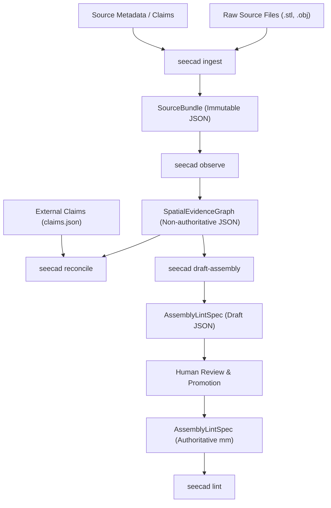

# Sprint 0001 Plan: Imported Geometry Spatial Evidence Loop

## Overview

The primary objective of Sprint 0001 is to establish a non-authoritative spatial evidence loop in SeeCAD. This enables agentic and human operators to ingest, observe, and reconcile raw 3D mesh geometry against claims and specifications without prematurely committing to or modifying authoritative semantic designs.

To achieve this, the sprint is bounded to the **P0 (Agent & Ingestion Foundation)** requirements and a **minimal P1 (Spatial Evidence Graph & Claim Reconciliation)** vertical slice. 

The scope is strictly limited to geometry ingestion and observation; fit/motion analysis (P2), manufacturing process evidence (P3), closed-loop design iteration (P4), and broad benchmarks (P5) are preserved as follow-on milestones.



### Invariant & Trust Boundaries

All development in this sprint must preserve SeeCAD's core invariants:
1. **Explicit Units:** Every distance, size, and coordinate must explicitly declare units in millimetres (`mm`). Coordinates from unitless formats (e.g., standard OBJ/STL) are treated as unitless in preview scopes but must be normalized to `mm` upon ingestion with explicit scaling and provenance metadata.
2. **Separation of Concerns:** The [SpatialEvidenceGraph](file:///Users/jmccarthy/code/seecad/docs/sprints/drafts/SPRINT-0001-GEMINI-DRAFT.md#spatialevidencegraph-schema) is non-authoritative. It records observations, hypotheses, and contradictions, but never compiles CAD or mutates [DesignSpec](file:///Users/jmccarthy/code/seecad/src/seecad/models.py#L508) or [AssemblyLintSpec](file:///Users/jmccarthy/code/seecad/src/seecad/assembly_lint.py#L106).
3. **Execution Safety:** Untrusted geometry parsers run locally under strict process constraints (CPU, memory, timeout) via bounded execution pipelines.
4. **No Side Effects:** Source meshes, generated reports, or `.env*` secrets must not be committed to git. Ephemeral mesh files are placed in a content-addressed storage (CAS) cache.

---

## Use Cases

### 1. Source Material Ingestion
An agent receives an external CAD model (e.g., an STL mesh representing a mounting bracket). The agent runs `seecad ingest` to record the source license, origin URL, retrieval metadata, files list, and coordinate decisions. The service copies the raw file into the content-addressed blob store and prints a `SourceBundle` metadata manifest.

### 2. Geometry Observation
The agent runs `seecad observe` against the ingested `SourceBundle`. The SeeCAD observation engine executes a sandboxed parser using `trimesh` to:
- Enumerate isolated mesh shells (candidate bodies).
- Calculate exact axis-aligned bounding boxes (AABBs).
- Detect geometry attributes (watertightness, winding consistency, surface area, volume).
- Propose feature hypotheses (such as passage channels or potential contact interfaces).
The observations are output as a `SpatialEvidenceGraph`.

### 3. Claim Reconciliation
The agent reconciles observed geometry traits against external marketing or listing claims (e.g., "Contains 6 compartments," "Fits 200 mm build plate"). Running `seecad reconcile` flags contradictions (e.g., finding 7 passages instead of 6) and logs them as bounded or heuristic findings in the evidence graph.

### 4. Assembly Manifest Drafting
Based on the reconciled evidence graph, the agent drafts an [AssemblyLintSpec](file:///Users/jmccarthy/code/seecad/src/seecad/assembly_lint.py#L106) manifest. Repeated physical instances are expanded into unique IDs with conservative AABBs. This draft is generated for human review. It is never marked authoritative until approved.

---

## Architecture

### Spatial Data Pipelines

Imported files pass through three states before reaching the linter:

1. **SourceBundle:** An immutable registry of input file metadata. Raw file data is copied to the content-addressed blob store (stored under `blobs/` indexed by SHA-256) and tracked by a `SourceBundle` metadata document.
2. **SpatialEvidenceGraph:** A collection of non-authoritative assertions derived from analyzing the `SourceBundle`. Nodes represent `ObservedBody` instances (geometry properties) and `ObservedFeature` occurrences (passages, clearances, stops, interfaces) along with evidence links.
3. **Draft Assembly Spec:** A generated JSON payload mapping `SpatialEvidenceGraph` bodies to physical [AssemblyPart](file:///Users/jmccarthy/code/seecad/src/seecad/assembly_lint.py#L53) nodes in the `1.0` schema format of [AssemblyLintSpec](file:///Users/jmccarthy/code/seecad/src/seecad/assembly_lint.py#L106).

```
+-----------------------------------------------------------------------------------+
|                                 SeeCAD Repository                                 |
|                                                                                   |
|  +--------------------+      +-----------------------+      +-------------------+  |
|  |    SourceBundle    | ---> | SpatialEvidenceGraph  | ---> | AssemblyLintSpec  |  |
|  | (Immutable source) |      | (Observations/Claims) |      |   (Draft spec)    |  |
|  +--------------------+      +-----------------------+      +-------------------+  |
|            |                             |                            |           |
|            v                             v                            v           |
|  +--------------------+      +-----------------------+      +-------------------+  |
|  |   Artifact Store   |      |   Observation Engine  |      |   Human Review    |  |
|  |  (blobs by sha256) |      |    (trimesh/numpy)    |      |  (Promotion gate) |  |
|  +--------------------+      +-----------------------+      +-------------------+  |
+-----------------------------------------------------------------------------------+
```

### Models & Schemas

The following Pydantic models will be added to [models.py](file:///Users/jmccarthy/code/seecad/src/seecad/models.py):

#### SourceBundle Schema

```python
class SourceFileRef(StrictModel):
    filename: str = Field(min_length=1, max_length=240)
    sha256: Annotated[str, StringConstraints(pattern=r"^[a-f0-9]{64}$")]
    size_bytes: int = Field(ge=0)
    media_type: str = Field(min_length=1, max_length=120)

class SourceBundle(StrictModel):
    schema_version: Literal["1.0"] = "1.0"
    bundle_id: Annotated[str, StringConstraints(pattern=r"^sbnd_[a-f0-9]{24}$")]
    created_at: datetime
    origin: str | None = Field(default=None, max_length=2000)
    license: str | None = Field(default=None, max_length=120)
    declared_units: Literal["mm", "m", "in", "unknown"] = "unknown"
    coordinate_frame: str | None = Field(default=None, max_length=120)
    parser_versions: dict[str, str] = Field(default_factory=dict)
    files: tuple[SourceFileRef, ...] = Field(min_length=1, max_length=256)
```

#### SpatialEvidenceGraph Schema

```python
class EvidenceReference(StrictModel):
    source_file_sha256: Annotated[str, StringConstraints(pattern=r"^[a-f0-9]{64}$")]
    region: str | None = Field(default=None, max_length=500)
    algorithm: str = Field(min_length=1, max_length=120)
    version: str = Field(min_length=1, max_length=64)

class ObservedBody(StrictModel):
    id: SafeIdentifier
    name: str = Field(min_length=1, max_length=120)
    shell_index: int = Field(ge=0)
    envelope: AssemblyEnvelope
    watertight: bool
    winding_consistent: bool
    volume_mm3: float | None = None
    surface_area_mm2: float
    evidence: EvidenceReference

class ObservedFeatureKind(StrEnum):
    PASSAGE = "passage"
    CLEARANCE = "clearance"
    STOP = "stop"
    INTERFACE = "interface"

class ObservedFeature(StrictModel):
    id: SafeIdentifier
    name: str = Field(min_length=1, max_length=120)
    kind: ObservedFeatureKind
    confidence: Confidence
    basis: str = Field(min_length=1, max_length=1000)
    value: float | bool | int | list[float] | None = None
    unit: str | None = None
    target_body_ids: tuple[SafeIdentifier, ...] = Field(default_factory=tuple)
    evidence: EvidenceReference

class ClaimReconciliationStatus(StrEnum):
    VERIFIED = "verified"
    CONTRADICTED = "contradicted"
    UNVERIFIED = "unverified"

class ClaimReconciliation(StrictModel):
    claim_id: SafeIdentifier
    claim_text: str = Field(min_length=1, max_length=1000)
    status: ClaimReconciliationStatus
    matching_observation_ids: tuple[SafeIdentifier, ...] = Field(default_factory=tuple)
    rationale: str = Field(min_length=1, max_length=1000)
    confidence: Confidence

class SpatialEvidenceGraph(StrictModel):
    schema_version: Literal["1.0"] = "1.0"
    graph_id: Annotated[str, StringConstraints(pattern=r"^evg_[a-f0-9]{24}$")]
    source_bundle_id: Annotated[str, StringConstraints(pattern=r"^sbnd_[a-f0-9]{24}$")]
    created_at: datetime
    bodies: tuple[ObservedBody, ...] = Field(default_factory=tuple)
    features: tuple[ObservedFeature, ...] = Field(default_factory=tuple)
    reconciliations: tuple[ClaimReconciliation, ...] = Field(default_factory=tuple)
    assumptions: tuple[str, ...] = Field(default_factory=tuple)
```

### Safe Geometry Observation Routines

Observation calculations will run in a resource-bounded Python process context, using `trimesh` and `numpy`:
- **Shell Extraction:** Individual bodies are isolated via `trimesh.Trimesh.split(only_watertight=False)`.
- **Passage Bores:** Discovered by evaluating boundary loops (mesh edges sharing only one face) and analyzing cross-sectional coordinate variations (e.g., ray casting or cylindrical fitting of interior vertices along primary axes).
- **Clearances:** Evaluated between bodies via `trimesh.proximity.ProximityQuery` to report minimum physical distance.
- **Rear Stops:** Identified by ray casting along detected passage vectors to check for intersecting closing walls belonging to the same body shell.
- **Monolithic Status:** Evaluated by checking whether the mesh is composed of a single contiguous vertex group.

---

## Implementation Plan

### Phase 1: Database and Model Definitions
- **Files:** [models.py](file:///Users/jmccarthy/code/seecad/src/seecad/models.py)
- **Tasks:**
  - Add the `SourceFileRef` and `SourceBundle` models.
  - Add the `EvidenceReference`, `ObservedBody`, `ObservedFeature`, `ClaimReconciliation`, and `SpatialEvidenceGraph` Pydantic models.
  - Write validation tests in [test_models.py](file:///Users/jmccarthy/code/seecad/tests/test_models.py).

### Phase 2: Ingestion Service & Artifact Storage
- **Files:** [store.py](file:///Users/jmccarthy/code/seecad/src/seecad/store.py), [service.py](file:///Users/jmccarthy/code/seecad/src/seecad/service.py)
- **Tasks:**
  - Extend [ArtifactStore](file:///Users/jmccarthy/code/seecad/src/seecad/store.py) to save raw mesh assets indexable by SHA-256 without tracking them in git.
  - Extend `SeeCADService` with `ingest_source(files: list[Path], origin: str, license: str) -> SourceBundle`.
  - Ensure ingestion enforces verification of file sizes, formats, and calculates SHA-256 hashes.

### Phase 3: Observation Engine
- **Files:** [analysis.py](file:///Users/jmccarthy/code/seecad/src/seecad/analysis.py), [service.py](file:///Users/jmccarthy/code/seecad/src/seecad/service.py)
- **Tasks:**
  - Implement geometry inspection methods: shell counting, AABB calculation, watertight/winding validations.
  - Implement `observe_passages` using boundary edge loops and coordinate slice analyses.
  - Implement `observe_clearance` via mesh proximity calculation.
  - Implement `observe_rear_stops` by checking passage exit occlusions.
  - Implement `reconcile_claims(graph: SpatialEvidenceGraph, claims: dict) -> SpatialEvidenceGraph` evaluating parameters like drawer counts, clearances, and monolithic status.
  - Integrate these methods into `SeeCADService.observe_source(bundle_id: str) -> SpatialEvidenceGraph`.

### Phase 4: CLI Interface Integration
- **Files:** [cli.py](file:///Users/jmccarthy/code/seecad/src/seecad/cli.py)
- **Tasks:**
  - Add the `seecad ingest` command, producing a `SourceBundle` JSON.
  - Add the `seecad observe` command, producing a `SpatialEvidenceGraph` JSON.
  - Add the `seecad draft-assembly` command, producing a draft `AssemblyLintSpec`.
  - Add the `seecad reconcile` command to check claims against the evidence graph.
  - Expose json/text formatting parity flags on all new commands.

### Phase 5: MCP Parity & Tool Expositions
- **Files:** [mcp_server.py](file:///Users/jmccarthy/code/seecad/src/seecad/mcp_server.py)
- **Tasks:**
  - Expose `lint_assembly` as an MCP tool accepting a manifest dict.
  - Expose `lint_mesh` as an MCP tool accepting a mesh file's base64 content or hash, profile dict, and units constraints.
  - Expose `ingest_source`, `observe_source`, `reconcile_claims`, and `draft_assembly` as MCP tools to give agents parity with the CLI workflow.

### Phase 6: Testing & Acceptance Fixture Integration
- **Files:** [tests/test_sprint0001.py](file:///Users/jmccarthy/code/seecad/tests/test_sprint0001.py) (new test suite file)
- **Tasks:**
  - Create a test setup that programmatically generates synthetic STL meshes (a shell box with 7 horizontal rectangular slots, and 1 drawer box sized to fit with 0.2 mm clearance).
  - Verify that `observe` correctly detects:
    - 8 physical occurrences (1 shell and 7 drawer copies mapped in space).
    - 7 compartments/passages (flagging a claim contradiction if claims.json asserts 6).
    - 0.2 mm clearance bounds.
    - Lack of a rear stop on the passages.
    - Monolithic shell body component count.
  - Verify overall validation suite via `make check`.

---

## Files Summary

| File Path | Role | Planned Changes |
| --- | --- | --- |
| [src/seecad/models.py](file:///Users/jmccarthy/code/seecad/src/seecad/models.py) | Schema Definitions | Define `SourceBundle` and `SpatialEvidenceGraph` Pydantic schemas. |
| [src/seecad/store.py](file:///Users/jmccarthy/code/seecad/src/seecad/store.py) | Artifact Storage | Update `ArtifactStore` to handle raw source file ingestion. |
| [src/seecad/service.py](file:///Users/jmccarthy/code/seecad/src/seecad/service.py) | Orchestration Service | Implement ingestion, observation, claim reconciliation, and draft generation. |
| [src/seecad/analysis.py](file:///Users/jmccarthy/code/seecad/src/seecad/analysis.py) | Geometry Engine | Add trimesh-based shell, passage, clearance, and rear stop observation logic. |
| [src/seecad/cli.py](file:///Users/jmccarthy/code/seecad/src/seecad/cli.py) | CLI Interface | Add `ingest`, `observe`, `draft-assembly`, and `reconcile` commands. |
| [src/seecad/mcp_server.py](file:///Users/jmccarthy/code/seecad/src/seecad/mcp_server.py) | Model Context Protocol | Expose new ingestion, observation, drafting, and reconciliation tools, plus existing `lint` operations. |
| `tests/test_sprint0001.py` | Integration Tests | Build synthetic organizer fixture and verify P0/P1 capabilities. |
| [docs/sprints/LEDGER.md](file:///Users/jmccarthy/code/seecad/docs/sprints/LEDGER.md) | Sprint Records | Record Sprint 0001 entry and track execution status. |

---

## Definition of Done

### Invariant & Compliance Checks
- [ ] Every spatial output, measurement, and clearance defaults strictly to millimetres (`mm`).
- [ ] All coordinates from unitless formats are explicitly marked as unitless in previews, and require an explicit declaration or conversion scale factor mapping them to `mm` at the ingestion boundary.
- [ ] The `SpatialEvidenceGraph` does not modify or inherit properties from authoritative [DesignSpec](file:///Users/jmccarthy/code/seecad/src/seecad/models.py#L508) or [AssemblyLintSpec](file:///Users/jmccarthy/code/seecad/src/seecad/assembly_lint.py#L106) instances.
- [ ] No downloaded CAD mesh files or generated reports are committed to git; all assets are stored inside the CAS artifact blob store.

### Test Verification
- [ ] CLI and MCP services return deterministic results for repeated analysis runs.
- [ ] Integration tests verify the synthetic organizer fixture detects:
  - Compartment count: 7 passages observed.
  - Clearance: 0.2 mm per-side gap.
  - Component status: monolithic outer shell.
  - Missing features: lack of positive rear stop.
  - Claim conflict: flags contradiction with claimed 6 compartments.
  - Provenance: license and origin verified.
- [ ] `make check` executes successfully.

---

## Risks and Mitigations

### 1. Complex or Degenerate STL Mesh Analysis
* **Risk:** The mesh files may be malformed (e.g. non-watertight, missing triangles, overlapping faces), causing `trimesh` splitting or ray casting algorithms to fail or report incorrect body counts.
* **Mitigation:** Fall back to warning diagnostics instead of raising a fatal crash. Label topological warnings as `heuristic` or `bounded` confidence levels in the `SpatialEvidenceGraph`.

### 2. Sandbox Resource Overruns
* **Risk:** Extremely large STL/OBJ inputs or complex geometric queries (e.g. proximity checks on high-poly meshes) could cause high memory usage or CPU starvation in the host environment.
* **Mitigation:** Limit file sizes at the ingestion boundary (e.g. max 128 MiB per mesh) and enforce thread timeout limits for the observation processes.

---

## Dependencies

- **Trimesh & NumPy:** Core computational libraries used for mesh manipulation and coordinate analysis.
- **Pydantic:** Serialization and validation of `SourceBundle` and `SpatialEvidenceGraph` schemas.
- **FastMCP:** Exposing service endpoints to the MCP server.

---

## Open Questions

1. **Graph Lifecycle:** Should the `SpatialEvidenceGraph` be persisted long-term in the SQLite database, or treated as a content-addressed JSON artifact inside the `ArtifactStore` linked to a specific `SourceBundle` digest? *(Proposed: Store as a content-addressed JSON artifact).*
2. **Ray-cast Resolution:** What is the optimal angular/spatial resolution for ray casting to determine passages and stops without impacting performance on low-performance runner environments?
3. **Units Confirmation Interface:** How should the React workbench handle the promotion of a draft assembly manifest when units are marked `unknown` in the `SourceBundle`? Should the workbench prompt the user for an explicit units override?
